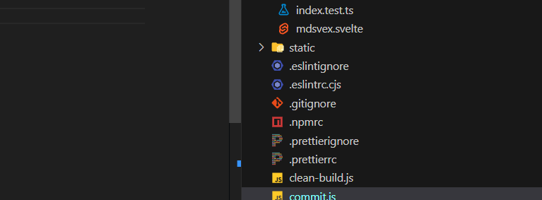

```js
import { simpleGit } from 'simple-git';
import path from 'path';
import fs from 'fs';

const checkDirectorySync = (dir) => {
	let err;
	try {
		fs.statSync(dir);
	} catch (e) {
		err = e;
	}
	return err === undefined ? true : false;
};

const gitRootPath = (dir) => {
	dir = dir || path.resolve('.');
	if (!checkDirectorySync(dir)) {
		console.error('Error: Path is invalid');
		process.exit(1);
	}
	if (checkDirectorySync(path.resolve(dir, '.git'))) {
		return dir;
	} else {
		const parent = path.resolve(dir, '..');
		if (parent === dir) {
			console.error('Error: This directory is not a git repository');
			process.exit(1);
		}
		return gitRootPath(parent);
	}
};

const git = simpleGit();

git
	.exec(() => console.log('Starting push...'))
	.addConfig('user.name', 'Samuele de Tomasi')
	.addConfig('user.mail', 'samuele@stranianelli.com')
	.addConfig('user.branch', 'main')
	.add(gitRootPath())
	.commit('commit', (a, b) => {
		console.log(a, b);
	})
	.push()
	.exec(() => console.log('Push done.'));
```
