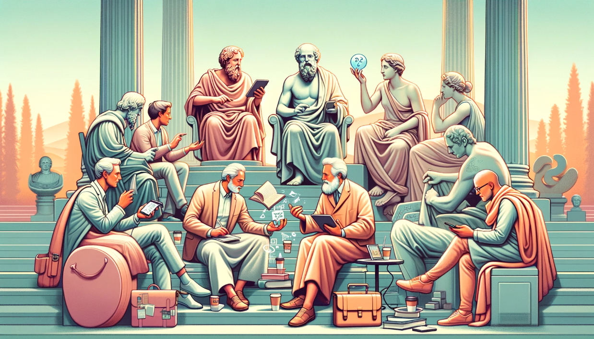

La filosofia del XXI secolo non esiste in un vuoto, ma è profondamente radicata nel ricco terreno della tradizione classica. In questo post, esamineremo come i concetti filosofici antichi vengono reinterpretati e applicati ai problemi moderni.

Prendiamo, ad esempio, le idee di Socrate sul dialogo e l'autoesame. Come possono queste pratiche antiche aiutarci a navigare nell'era dell'informazione e delle fake news? Oppure, consideriamo l'etica aristotelica - come può guidarci nell'era delle scelte morali complesse legate all'avanzamento tecnologico?

I filosofi moderni attingono spesso da queste fonti antiche per costruire nuove teorie e approcci. La resilienza di queste idee dimostra che, anche se i tempi cambiano, ci sono alcune verità e interrogativi che restano universali.

Questo post invita a un'esplorazione di come il dialogo tra passato e presente possa arricchire la nostra comprensione della filosofia e della vita.
