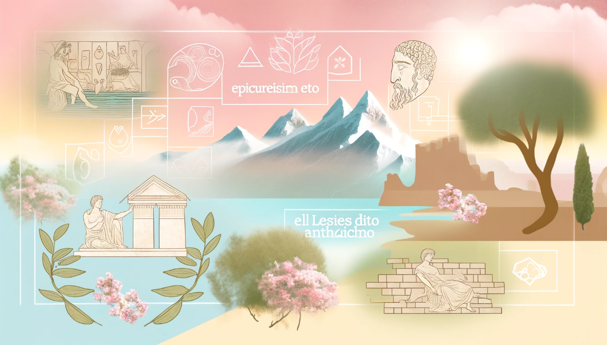

L'Epicureismo e lo Stoicismo, due scuole di pensiero dell'antica Grecia e Roma, offrono lezioni di vita ancora rilevanti nel mondo moderno. In questo post, esploriamo come questi insegnamenti antichi possono essere applicati oggi.

L'Epicureismo, fondato da Epicuro, insegna che la chiave della felicità sta nel piacere, inteso come assenza di dolore e disturbo mentale. Questa filosofia suggerisce che dovremmo cercare piaceri moderati e sostenibili, valorizzando l'amicizia e la riflessione personale.

Lo Stoicismo, d'altra parte, fondato da Zenone di Cizio, pone l'accento sulla virtù e il controllo interiore. Secondo gli stoici, possiamo raggiungere una vita soddisfacente accettando ciò che non possiamo cambiare e lavorando per migliorare ciò che possiamo controllare.

Entrambe queste filosofie offrono strumenti per affrontare le sfide della vita moderna. L'Epicureismo ci insegna a godere della vita con moderazione e apprezzare i piccoli piaceri, mentre lo Stoicismo fornisce un quadro per affrontare le difficoltà con forza interiore e resilienza.

Questo post esplora come queste antiche saggezze possano guidarci nella ricerca di una vita equilibrata e significativa nel caotico mondo moderno.
