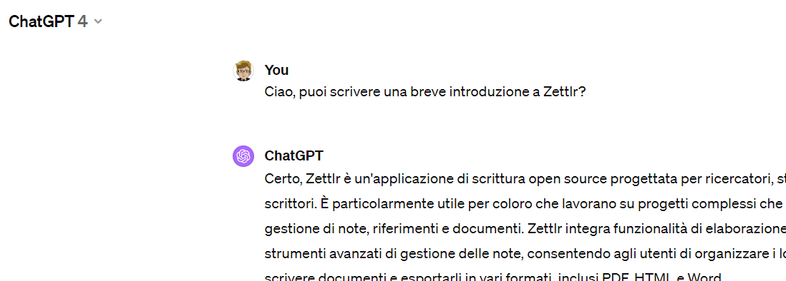

Zettlr è un'applicazione di scrittura open source progettata per ricercatori, studenti e scrittori. È particolarmente utile per coloro che lavorano su progetti complessi che richiedono la gestione di note, riferimenti e documenti. **Zettlr** integra funzionalità di elaborazione di testi con strumenti avanzati di gestione delle note, consentendo agli utenti di organizzare i loro appunti, scrivere documenti e esportarli in vari formati, inclusi PDF, HTML e Word.

Una delle caratteristiche distintive di Zettlr è il suo supporto per Markdown, un linguaggio di markup leggero che consente di formattare il testo utilizzando una sintassi semplice. Ciò facilita la scrittura e la modifica di documenti, _rendendo_ Zettlr una scelta popolare tra coloro che preferiscono concentrarsi sul contenuto piuttosto che sulla formattazione.

Zettlr supporta anche le citazioni e la bibliografia attraverso l'integrazione con Zotero, un popolare gestore di riferimenti, permettendo agli utenti di inserire facilmente citazioni e gestire la bibliografia nei loro documenti. Inoltre, Zettlr offre funzionalità di ricerca potenti, modalità di visualizzazione che aiutano a concentrarsi sulla scrittura e l'abilità di **collegare** note tra loro per creare una rete di informazioni interconnesse.

Con il suo focus sulla produttività e l'organizzazione, Zettlr si rivolge a chi cerca un ambiente di scrittura versatile che possa adattarsi a una varietà di esigenze di progetto. Grazie alla sua natura open source, Zettlr continua a evolversi con il contributo della sua comunità di utenti, aggiungendo nuove funzionalità e miglioramenti per soddisfare le esigenze dei suoi utenti.
